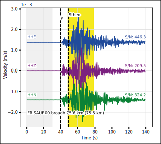
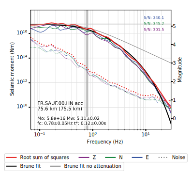

# SourceSpec

Earthquake source parameters from P- or S-wave displacement spectra

[![PyPI-badge]][PyPI-link]
[![license-badge]][license-link]
[![docs-badge]][docs-link]
[![DOI-badge]][DOI-link]

Copyright (c) 2011-2023 Claudio Satriano <satriano@ipgp.fr>

## Description

SourceSpec is a collection of command line tools to compute earthquake source
parameters (seismic moment, corner frequency, radiated energy, source size,
static stress drop, apparent stress) from the inversion of P-wave and S-wave
displacement spectra recorded at one or more seismic stations.
SourceSpec also computes attenuation parameters (t-star, quality factor) and,
as a bonus, local magnitude.

See [Madariaga (2011)][Madariaga2011] for a primer on earthquake source
parameters and scaling laws.

Go to section [Theoretical background](#theoretical-background) below to get
more information on how the code works. More details are available on the
official SourceSpec [documentation].

SourceSpec is written in Python and requires a working Python environment to
run (see [Installation](#installation) below). However, since SourceSpec is
based on command line, you don't have to know how to code in Python to use it.

The SourceSpec package is made of several command line tools:

- `source_spec`: Compute earthquake source parameters from the inversion
  of P- or S-wave spectra.
- `source_model`: Direct modelling of P- or S-wave spectra, based on
  user-defined earthquake source parameters.
- `source_residuals`: Compute station residuals from `source_spec` output.
- `clipping_detection`: Test the clipping detection algorithm.
- `plot_sourcepars`: 1D or 2D plot of source parameters from a sqlite
  parameter file.

## Getting Started

### For the impatient

> Note that the default config parameters are suited for a M<5 earthquake
> recorded within ~100 km. Adjust `win_length`, `noise_pre_time`, the
> frequency bands (`bp_freqmin_*`, `bp_freqmax_*`, `freq1_*`, `freq2_*`),
> and the bounds on `fc` and `t_star`, according to your problem.

#### Use case: miniSEED + StationXML + QuakeML

If you have seismic recordings in [miniSEED] format (e.g., `traces.mseed`),
metadata in [StationXML] format (e.g., `station.xml`) and event information in
[QuakeML] format (e.g., `event.xml`), then:

1. Generate a config file via `source_spec -S`;
2. Edit the config file variable `station_metadata` to point to `station.xml`
   file;
3. Run `source_spec -t traces.mseed -q event.xml`.

#### Use case: SAC + PAZ + SourceSpec Event File

If you have seismic recordings in [SAC] format (e.g., in a directory named
`sac_data`), metadata as [SAC polezero (PAZ)] (e.g., in a directory named
`paz`) and event information in any format, then:

1. Generate a config file via `source_spec -S`;
2. Edit the config file variable `station_metadata` to point to the `paz`
   directory;
3. Generate a sample [SourceSpec Event File] using `source_spec -y`; this
   will create a file named `ssp_event.yaml`;
4. Edit the file `ssp_event.yaml` with your event information;
5. Run `source_spec -t sac_data -H ssp_event.yaml`.

### Command line arguments

After successfully installed SourceSpec (see [Installation](#installation)
below), you can get help on the command line arguments used by each code by
typing from your terminal:

    source_spec -h

(or `source_model -h`, or `source_residuals -h`).

`source_spec` and `source_model` require you to provide the path to seismic
traces via the `--trace_path` command line argument (see
[File formats](#file-formats) below).

Information on the seismic event can be stored in the trace header ([SAC]
format), or provided through a [QuakeML] file (`--qmlfile`) or
or, alternatively (`--hypocenter`), through a [SourceSpec Event File],
a [HYPO71] file, or a [HYPOINVERSE-2000] file.
See [File formats](#file-formats) below for more information on the supported
file formats.

### Configuration file

`source_spec` and `source_model` require a configuration file. The default file
name is `source_spec.conf`, other file names can be specified via the
`--configfile` command line argument.

You can generate a sample configuration file through:

    source_spec -S

Take your time to go through the generated configuration file (named
`source_spec.conf`): the comments within the file will guide you on how to set
up the different parameters.

## File Formats

### Trace formats

SourceSpec can read all the
[trace formats supported by ObsPy][obspy_trace_formats].

Two very common choices are:

- [miniSEED]
- [SAC]

The SAC format can carry additional information in its header, like event
location and origin time, phase picks, instrument sensitivity.

### Event formats

SourceSpec can read event information (event ID, location, origin time) in the
following formats:

- [SourceSpec Event File]: this file can contain additional event information,
  such as magnitude, moment tensor or focal mechanism
- [QuakeML]: this file can contain additional event information, such as
  magnitude, moment tensor or focal mechanism. If phase picks are available,
  they will be read as well
- [HYPO71]
- [HYPOINVERSE-2000]: if phase picks are available, they will be read as well

Event information can also be stored in the [SAC file header] (header fields:
`EVLA`, `EVLO`, `EVDP`, `O`, `KEVNM`).

### Phase pick formats

Phase picks for P and S waves can be read from one of the following formats:

- [QuakeML]
- [HYPO71]
- [HYPOINVERSE-2000]

Phase picks can also be stored in the [SAC file header], using the header
fields `A` and `T0` through `T9`. A pick label can be specified (header fields
`KA` and `KT0` through `KT9`) to identify the pick; the pick label can be a
standard 4-characters SAC label (e.g., `"IPU0"`, `" S 1"`) or a label starting
with `"P"` or `"S"` (lowercase or uppercase, e.g., `"P"`, `"pP"`, `"Pg"`,
`"S"`, `"Sn"`).
Picks with labels that cannot be parsed by SourceSpec will be ignored.
If no label is specified, then SourceSpec will assume that `A` is the P-pick
and `T0` is the S-pick.

### Station metadata formats

Station metadata (coordinates, instrumental response) can be provided in one of
the following formats:

- [StationXML]
- [Dataless SEED]
- [SEED RESP]
- [SAC polezero (PAZ)]

Note that SEED RESP and PAZ formats do not contain station coordinates, which
should therefore be in the trace header (traces in SAC format).

The station metadata file name or file directory is provided in the
configuration file through the parameter `station_metadata`.

Alternatively, instrument sensitivity can be provided in the SAC header or as a
constant in the configuration file. In both cases, use the configuration
parameter `sensitivity`.

### Output files

The SourceSpec main code, `source_spec` will produce the following output files
(`EVID` is replaced by the actual event ID):

- `EVID.ssp.yaml`: [YAML] file containing the estimated spectral parameters
  (summary values and per station values)
- `EVID.ssp.out` (*deprecated*): text file containing the estimated spectral
  parameters (summary values and per station values)
- `EVID.ssp.log`: log file in text format (including the command line arguments,
  for [reproducibility])
- `EVID.ssp.conf`: the input config file (for [reproducibility])
- `EVID-residuals.pickle`: station residuals in
  [Python pickle format][pickle]
- `EVID.ssp.h`: hypocenter file in [HYPO71] format with the estimated moment
  magnitude (only if an input HYPO71 file is provided)
- `EVID.xml`: updated [QuakeML] file with the results of the SourceSpec
  inversion (only if an input QuakeML file is provided)

The following plots will be created, in png, pdf or svg format:

- `EVID.traces.png[.pdf,.svg]`: trace plots
- `EVID.ssp.png[.pdf,.svg]`: spectral plots
- `EVID.sspweight.png[.pdf,.svg]`: spectral weight plots
- `EVID.boxplot.png[.pdf,.svg]`: [box plots][box_plot] for the earthquake source
  parameters retrieved at each station
- Misfit plots, when using "grid search" or "importance sampling" for the
  spectral inversion

As an option, station maps can be created (requires [Cartopy]):

- `EVID.map_mag.png[.pdf,.svg]`: station map with symbols colored by estimated
  moment magnitude
- `EVID.map_fc.png[.pdf,.svg]`: station map with symbols colored by estimated
  corner frequency

As an option, the retrieved source parameters (per station and summary) can be
appended to a [SQLite] database, whose path is defined in the configuration
file.

Finally, always as an option, `source_spec` can generate a report in HTML
format.

## Theoretical Background

For each station, the code computes P- or S-wave displacement amplitude spectra
for each component (e.g., Z, N, E), then combines the component spectra through
the root sum of squares:

$$
    S(f) = \sqrt{S^2_z(f) + S^2_n(f) + S^2_e(f)}
$$

where $f$ is frequency and $S_x(f)$ is the P- or S-wave spectrum for component
$x$.

It then inverts spectra for a 3-parameter [Brune (1970)][Brune1970] source
model:

$$
    S(f) = C \cdot \frac{M_0}{1+(f/f_c)^2} \cdot e^{-\pi f t^*}
$$

where the three parameters to determine are:

- the seismic moment $M_0$
- the corner frequency $f_c$
- the attenuation parameter $t^*$

and $C$ is a coefficient containing geometrical spreading, radiation pattern,
seismic wave speed and medium density.

The inversion is performed in moment magnitude $M_w$ units (logarithmic
amplitude). Different inversion algorithms can be used:

- TNC: [truncated Newton algorithm] (with bounds)
- LM: [Levenberg-Marquardt algorithm]
  (warning: [Trust Region Reflective algorithm] will be used instead if
   bounds are provided)
- BH: [basin-hopping algorithm]
- GS: [grid search]
- IS: [importance sampling] of misfit grid, using [k-d tree]

Starting from the inverted parameters $M_0$ ( $M_w$ ), $fc$, $t^*$ and
following the equations in [Madariaga (2011)][Madariaga2011] and
[Lancieri (2012)][Lancieri2012], other quantities are computed for each
station:

- the Brune static stress drop $\Delta \sigma$
- the source radius $a$
- the radiated energy $E_r$
- the apparent stress $\sigma_a$
- the quality factor $Q_0$ of P- or S-waves

As a bonus, local magnitude $M_l$ can be computed as well.

Event summaries (mean, weighted mean, percentiles) are computed from single
station estimates. For mean and weighted mean estimation, outliers are rejected
based on the [interquartile range] rule.

See the official [documentation] for more details.

 **Example three-component trace plot
(in velocity), showing noise and S-wave windows**

**Example displacement spectrum for noise and S-wave, including inversion
results**

## Installation

SourceSpec requires at least Python 3.7. All the required dependencies will be
downloaded and installed during the setup process.

### Installing the latest release

### Using Anaconda

The following command will automatically create an [Anaconda] environment
named `sourcespec`, install the required packages and install the latest
version of SourceSpec via `pip`:

    conda env create --file https://raw.githubusercontent.com/SeismicSource/sourcespec/main/sourcespec_conda_env.yml

If you want a different name for your environment, use:

    conda env create -n YOUR_ENV_NAME --file https://raw.githubusercontent.com/SeismicSource/sourcespec/main/sourcespec_conda_env.yml

Activate the environment with:

    conda activate sourcespec

(or `conda activate YOUR_ENV_NAME`)

To keep SourceSpec updated run:

    pip install --upgrade sourcespec

from within your environment.

#### Using pip and PyPI

The latest release of SourceSpec is available on the
[Python Package Index](https://pypi.org/project/sourcespec/).

You can install it easily through `pip`:

    pip install sourcespec

To upgrade from a previously installed version:

    pip install --upgrade sourcespec

#### From SourceSpec GitHub releases

Download the latest release from the
[releases page](https://github.com/SeismicSource/sourcespec/releases),
in `zip` or `tar.gz` format, then:

    pip install sourcespec-X.Y.zip

or

    pip install sourcespec-X.Y.tar.gz

Where, `X.Y` is the version number (e.g., `1.2`).
You don't need to uncompress the release files yourself.

### Installing a developer snapshot

If you need a recent feature that is not in the latest release (see the
`unreleased` section in [CHANGELOG](CHANGELOG.md)), you want to use the more
recent development snapshot from the
[SourceSpec GitHub repository](https://github.com/SeismicSource/sourcespec).

#### Using pip

The easiest way to install the most recent development snapshot is to download
and install it through `pip`, using its builtin `git` client:

    pip install git+https://github.com/SeismicSource/sourcespec.git

Run this command again, from times to times, to keep SourceSpec updated with
the development version.

### Cloning the SourceSpec GitHub repository

If you want to take a look at the source code (and possibly modify it 😉),
clone the project using `git`:

    git clone https://github.com/SeismicSource/sourcespec.git

or, using SSH:

    git clone git@github.com:SeismicSource/sourcespec.git

(avoid using the "Download ZIP" option from the green "Code" button, since
version number is lost).

Then, go into the `sourcespec` main directory and install the code in "editable
mode" by running:

    pip install -e .

You can keep your local SourceSpec repository updated by running `git pull`
from times to times. Thanks to `pip`'s "editable mode", you don't need to
reinstall SourceSpec after each update.

## Documentation

The official SourceSpec documentation can be find at
[sourcespec.readthedocs.io][documentation].

## Sample Runs

Several sample runs are available in the
[sourcespec_testruns](https://github.com/SeismicSource/sourcespec_testruns)
repository.

## Getting Help / Reporting Bugs

### 🙏 I need help

Join the SourceSpec [Discussions] and feel free to ask!

### 🐞 I found a bug

Please open an [Issue][Issues].

## Contributing

I'm very open to contributions: if you have new ideas, please open an
[Issue][Issues].
Don't hesitate sending me pull requests with new features and/or bugfixes!

## How to Cite

If you used SourceSpec for a scientific paper, please cite it as:

> Satriano, C. (2023). SourceSpec – Earthquake source parameters from
> P- or S-wave displacement spectra (X.Y).
> [doi: 10.5281/ZENODO.3688587]

Please replace `X.Y` with the SourceSpec version number you used.

You can also cite the following abstract presented at the
2016 AGU Fall Meeting:

> Satriano, C., Mejia Uquiche, A. R., & Saurel, J. M. (2016). Spectral
> estimation of seismic moment, corner frequency and radiated energy for
> earthquakes in the Lesser Antilles. In AGU Fall Meeting Abstracts
> (Vol. 2016, pp. S13A-2518), [bibcode: 2016AGUFM.S13A2518S]

## References

- Brune, J. N. (1970). Tectonic stress and the spectra of seismic shear waves
  from earthquakes, J. Geophys. Res., 75 (26), 4997– 5009,
  [doi: 10.1029/JB075i026p04997]
- Lancieri, M., Madariaga, R., Bonilla, F. (2012). Spectral scaling of the
  aftershocks of the Tocopilla 2007 earthquake in northern Chile, Geophys. J.
  Int., 189 (1), 469–480, [doi: 10.1111/j.1365-246X.2011.05327.x]
- Madariaga, R. (2011). Earthquake Scaling Laws. In "Extreme Environmental
  Events", pp. 364–383, [doi: 10.1007/978-1-4419-7695-6_22]. Available on
  [ResearchGate][Madariaga2011].

<!-- Badges and project links -->
[PyPI-badge]: http://img.shields.io/pypi/v/sourcespec.svg
[PyPI-link]: https://pypi.python.org/pypi/sourcespec
[license-badge]: https://img.shields.io/badge/license-CeCILL--2.1-green.svg
[license-link]: http://www.cecill.info/licences.en.html
[docs-badge]: https://readthedocs.org/projects/sourcespec/badge/?version=latest
[docs-link]: https://sourcespec.readthedocs.io/en/latest/?badge=latest
[DOI-badge]: https://zenodo.org/badge/DOI/10.5281/zenodo.3688587.svg
[DOI-link]: https://doi.org/10.5281/zenodo.3688587
[documentation]: https://sourcespec.readthedocs.io
[Discussions]: https://github.com/SeismicSource/sourcespec/discussions
[Issues]: https://github.com/SeismicSource/sourcespec/issues
[Anaconda]: https://www.anaconda.com/products/individual

<!-- File formats -->
[obspy_trace_formats]: https://docs.obspy.org/packages/autogen/obspy.core.stream.read.html
[miniSEED]: http://ds.iris.edu/ds/nodes/dmc/data/formats/miniseed/
[SAC]: https://ds.iris.edu/ds/support/faq/17/sac-file-format/
[SAC file header]: https://ds.iris.edu/files/sac-manual/manual/file_format.html
[SourceSpec Event File]: https://sourcespec.readthedocs.io/en/latest/source_spec_event_file.html
[QuakeML]: https://quake.ethz.ch/quakeml/
[HYPO71]: https://pubs.er.usgs.gov/publication/ofr72224
[HYPOINVERSE-2000]: https://pubs.er.usgs.gov/publication/ofr02171
[StationXML]: http://docs.fdsn.org/projects/stationxml/en/latest/
[Dataless SEED]: https://ds.iris.edu/ds/nodes/dmc/data/formats/dataless-seed/
[SEED resp]: https://ds.iris.edu/ds/nodes/dmc/data/formats/resp/
[SAC polezero (PAZ)]: https://www.jakewalter.net/sacresponse.html
[pickle]: https://docs.python.org/3/library/pickle.html
[Cartopy]: https://scitools.org.uk/cartopy/docs/latest
[SQLite]: https://www.sqlite.org
[YAML]: https://yaml.org

<!-- Methods -->
[reproducibility]: https://en.wikipedia.org/wiki/Reproducibility
[box_plot]: https://en.wikipedia.org/wiki/Box_plot
[truncated Newton algorithm]: https://en.wikipedia.org/wiki/Truncated_Newton_method
[Levenberg-Marquardt algorithm]: https://en.wikipedia.org/wiki/Levenberg–Marquardt_algorithm
[Trust Region Reflective algorithm]: https://en.wikipedia.org/wiki/Trust_region
[interquartile range]: https://en.wikipedia.org/wiki/Interquartile_range
[basin-hopping algorithm]: https://en.wikipedia.org/wiki/Basin-hopping
[grid search]: https://en.wikipedia.org/wiki/Hyperparameter_optimization#Grid_search
[importance sampling]: http://alomax.free.fr/nlloc/octtree/OctTree.html
[k-d tree]: https://en.wikipedia.org/wiki/K-d_tree

<!-- References -->
[doi: 10.5281/ZENODO.3688587]: https://doi.org/10.5281/ZENODO.3688587
[bibcode: 2016AGUFM.S13A2518S]: https://ui.adsabs.harvard.edu/abs/2016AGUFM.S13A2518S
[doi: 10.1007/978-1-4419-7695-6_22]: https://doi.org/10.1007/978-1-4419-7695-6_22
[doi: 10.1029/JB075i026p04997]: https://doi.org/10.1029/JB075i026p04997
[doi: 10.1111/j.1365-246X.2011.05327.x]: https://doi.org/10.1111/j.1365-246X.2011.05327.x
[Brune1970]: https://doi.org/10.1029/JB075i026p04997
[Lancieri2012]: https://doi.org/10.1111/j.1365-246X.2011.05327.x
[Madariaga2011]: https://www.researchgate.net/publication/226065848_Earthquake_Scaling_Laws
