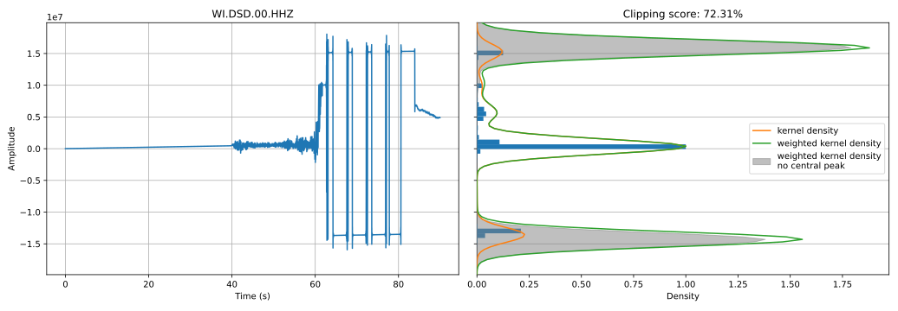
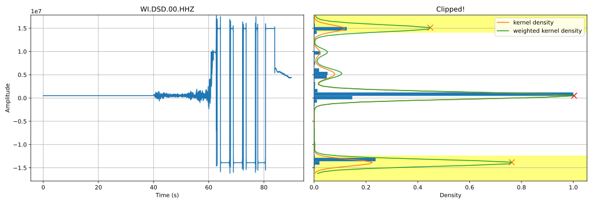

.. _clipping_detection:

##################
Clipping Detection
##################

SourceSpec can optionally check for clipping in the traces.
Two algorithms are available for this purpose:

1. :ref:`clipping-score-algorithm` (default): compute a trace clipping score
   based on the shape of the kernel density estimation.
2. :ref:`clipping-peaks-algorithm`: check if trace is clipped, based on the
   number of peaks in the kernel density estimation;

Both algorithms are based on the kernel density estimation of the trace
amplitude values, using the :class:`scipy.stats.gaussian_kde` class.
See the documentation of this class for more details on the kernel density.

The clipping detection algorithm is selected through the
``clipping_detection_algorithm`` parameter in the :ref:`configuration_file`.
The algorithm options are set via the configuration file.

Debug plots cand be activated by setting the ``clipping_debug_plot`` parameter
in the :ref:`configuration_file` to ``True``.

A command line script (``clipping_detection``) is available to test the
clipping detection algorithm on a set of traces. Run:

.. code-block:: bash

    $ clipping_detection --help

for details on the script usage.

.. _clipping-score-algorithm:

"Clipping Score" algorithm
~~~~~~~~~~~~~~~~~~~~~~~~~~

The "Clipping Score" algorithm computes a trace clipping score based on the
shape of the kernel density estimation of the trace amplitude values.

The algorithm is based on the following steps:

1. The trace is detrended and demeaned. Optionally, the trace baseline
   can be removed (if the configuration parameter ``remove_baseline`` is set
   to ``True``)

2. A kernel density estimation is computed on the trace amplitude values.

3. Two weighted kernel density functions are computed:

      - a full weighted kernel density, where the kernel density is
        weighted by the distance from the zero mean amplitude value,
        using a 8th order power function between 1 and 100.
      - a weighted kernel density without the central peak, where the
        kernel density is weighted by the distance from the zero mean
        amplitude value, using a 8th order power function between 0
        and 100.

   In both cases, the weight gives more importance to samples far from
   the zero mean value. In the second case, the central peak is ignored.

4. The score, ranging from 0 to 100, is the sum of the squared weighted
   kernel density without the central peak, normalized by the sum of
   the squared full weighted kernel density. The score is 0 if there is
   no additional peak beyond the central peak.

5. The trace is considered clipped if the score is above the
   ``clipping_score_threshold`` config parameter.

See the :func:`clipping_detection.clipping_score()` function for more
details.

  Example debug plot for the "Clipping Score" algorithm. The score is the sum
  of the squared weighted kernel density without the central peak (shaded
  area), normalized by the sum of the squared full weighted kernel density
  (green curve). The largest the peaks far from the central peak, the higher
  the score.

.. _clipping-peaks-algorithm:

"Clipping Peaks" algorithm
~~~~~~~~~~~~~~~~~~~~~~~~~~

The "Clipping Peaks" algorithm checks if a trace is clipped, based on the
number of peaks in the kernel density estimation of the trace amplitude values.

The algorithm is based on the following steps:

1. The trace is demeaned.

2. A kernel density estimation is computed on the trace amplitude values.

3. The kernel density estimation is weighted by the distance from the
   zero mean amplitude value, using a parabolic function, between 1 and 5.

4. Peaks are detected in the weighted kernel density estimation. The
   sensitivity of the peak detection algorithm is controlled by the
   ``clipping_peaks_sensitivity`` parameter, based on which a minimum
   prominence threshold is set.

5. The trace is considered clipped if there is at least one peak in the
   amplitude range corresponding to the ``clipping_peaks_percentile``
   parameter.

See the :func:`clipping_detection.clipping_peaks()` function for more
details.

  Example debug plot for the "Clipping Peaks" algorithm. If there is at least
  one peak in the amplitude range corresponding to the
  ``clipping_peaks_percentile`` (yellow areas), the trace is considered
  clipped.
